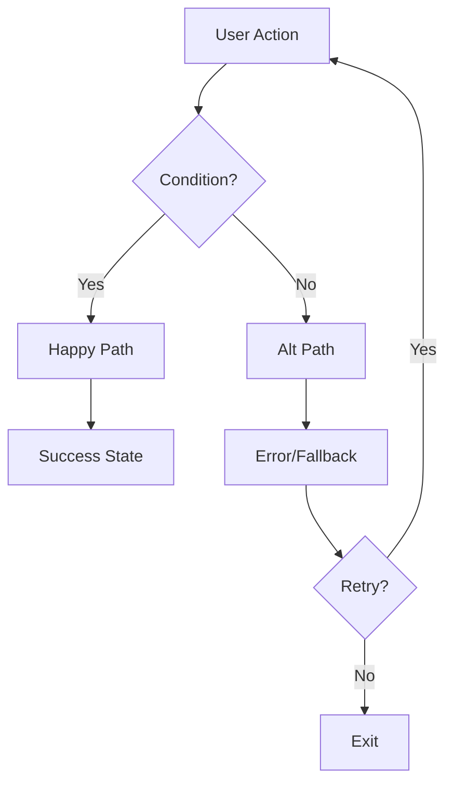
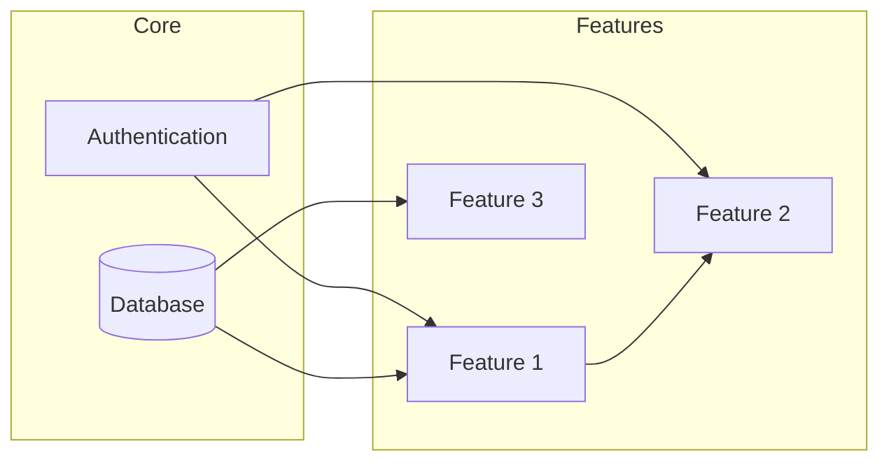
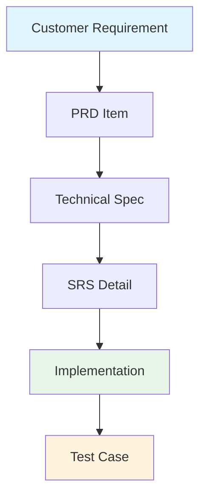
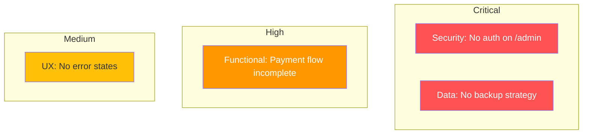
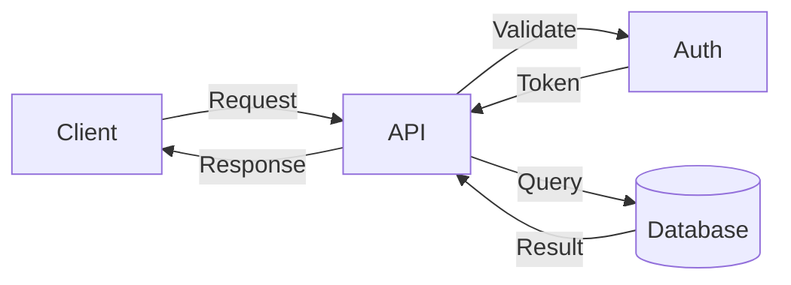
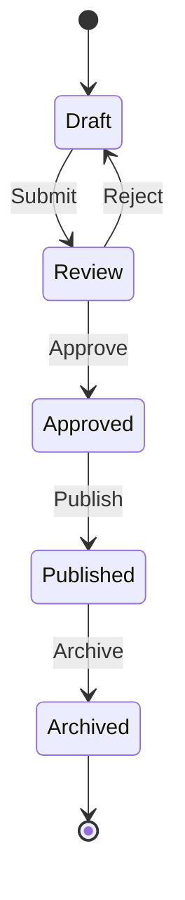

# Mermaid Flow Examples for Audit

## User Flow Diagram

## Feature Dependency Map

## Requirement Traceability

## Risk Heat Map (as flowchart)

## Data Flow

## State Machine (for feature states)

## Tips
- Use `subgraph` to group related features
- Color-code by status: green=complete, yellow=partial, red=missing
- Keep diagrams focused - max 15-20 nodes per diagram
- Split complex flows into multiple diagrams
