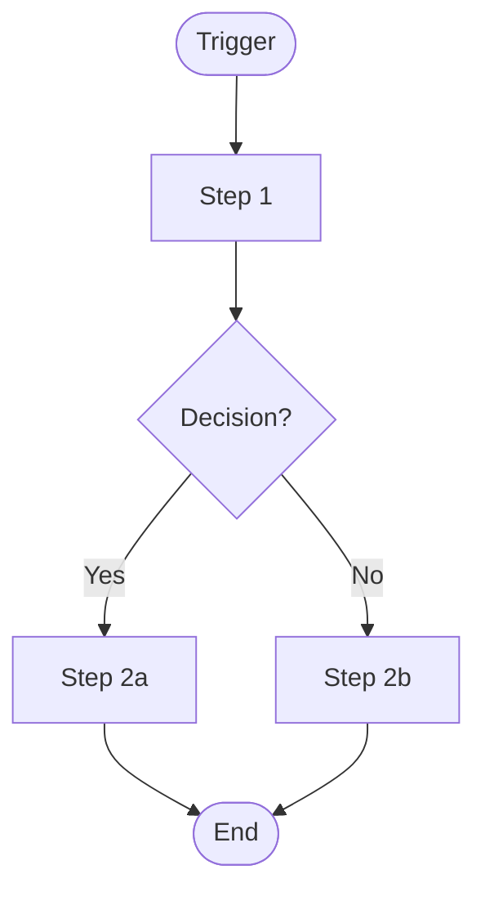
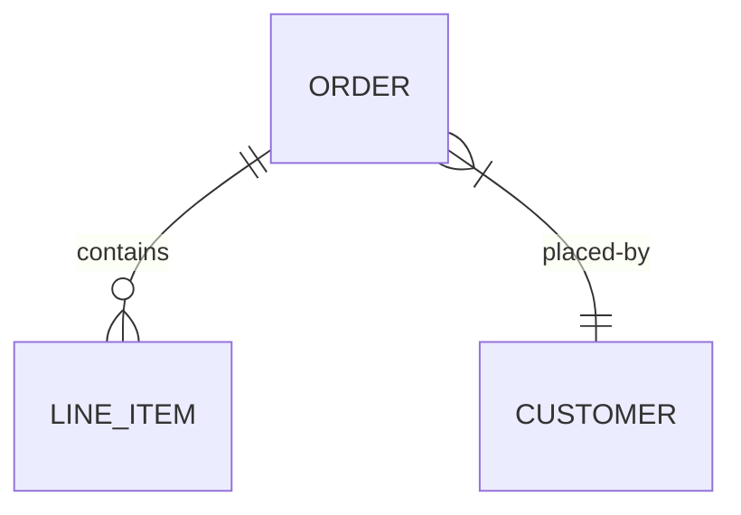

# Process Deep Dive Output Format

Use this template exactly when generating the final spec.

---

```markdown
# Process Spec: [Process Name] (PROC-XXX)

**Ngày:** YYYY-MM-DD | **Phòng ban:** [Dept] | **Process Owner:** [Role]
**Nguồn:** [catalog/roadmap ref or "Fresh interview"] | **Automation Type:** [AI Agent / n8n / Script / TBD]

## 1. Overview

| Field | Value |
|-------|-------|
| Mục đích | [Why this process exists] |
| Trigger | [What starts it] |
| Kết quả | [What it produces] |
| Frequency | [How often — daily / weekly / per order / etc.] |
| Duration | [Current average time end-to-end] |
| Volume | [Transactions per period] |

## 2. Happy Path

### Flow Diagram



### Step-by-Step

| Step | Action | Actor | System | Data In | Data Out | Time | Notes |
|------|--------|-------|--------|---------|----------|------|-------|
| 1 | [Specific action] | [Role] | [Tool] | [Input data] | [Output data] | [X min] | |
| 2 | ... | ... | ... | ... | ... | ... | |

### Decision Points

| # | Condition | If True | If False | Criteria |
|---|-----------|---------|----------|----------|
| D1 | [What is evaluated] | [Path A] | [Path B] | [Exact threshold or rule] |

## 3. Exceptions & Edge Cases

| EC-ID | Step | Trigger | Handling | Escalation | Frequency |
|-------|------|---------|----------|------------|-----------|
| EC-01 | Step 2 | [Condition that causes failure] | [Exact recovery steps] | [Who / what next] | Rare / Occasional / Common |

## 4. Data Model

### Entities

| Entity | Key Fields | Source | Storage |
|--------|-----------|--------|---------|
| [Name] | [field1, field2, ...] | [Where it comes from] | [Where it lives] |

### Relationships



### Validation Rules

| Field | Rule | Example |
|-------|------|---------|
| [Field name] | [Business rule] | [Valid: X / Invalid: Y] |

## 5. Business Rules

| Rule-ID | Description | Formula / Logic | Example |
|---------|------------|-----------------|---------|
| BR-01 | [Rule name] | [IF/THEN or formula] | [Worked example with real numbers] |

## 6. Integration Map

| System A | System B | Method | Data Transferred | Frequency |
|----------|----------|--------|------------------|-----------|
| [Tool] | [Tool] | API / File / Manual / Email | [What moves] | [When] |


## 7. SLA & Performance

| Metric | Target | Current | Gap |
|--------|--------|---------|-----|
| Processing time | [X hours] | [Y hours] | [±Z] |
| Error rate | [<X%] | [Y%] | [±Z%] |
| Customer response | [X hours] | [Y hours] | [±Z] |

## 8. Automation Recommendation

- **Type:** [AI Agent / AI Automation / n8n / Script / Hybrid]
- **Steps to automate:** [List step numbers + classification A/B/C/D per step]
- **Steps to keep manual:** [Which steps and why — judgment / relationship / legal]
- **Prerequisites:** [What must exist before automation can start]
- **Estimated effort:** [Person-days]
- **Expected improvement:** [Time saved / error reduction / cost impact]

**Classification legend:**
- A — Full AI: rule-based, no judgment needed
- B — AI + Review: AI does work, human verifies
- C — Human-led: human does work, AI assists
- D — Human-only: requires judgment, creativity, or relationship

## 9. Dev Handoff Checklist

- [ ] All happy path steps documented with actor + system + data + time
- [ ] All decision criteria are explicit and testable
- [ ] Edge cases have concrete handling procedures
- [ ] Data model supports all described operations
- [ ] Business rules have worked examples with real numbers
- [ ] Integration points have method + data format defined
- [ ] SLA targets defined in measurable units
- [ ] Automation classification assigned per step (A/B/C/D)

## 10. Open Questions

| # | Question | Owner | Due |
|---|----------|-------|-----|
| Q1 | [Unresolved item] | [Who can answer] | [Date] |
```
