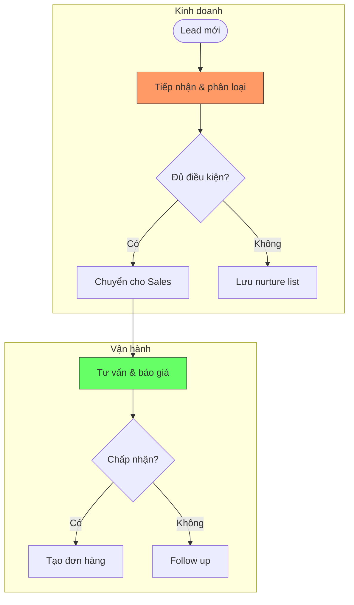

# Business Process Mapping

Transform business knowledge base into structured process catalog with visual diagrams.

**Input:** Knowledge Base from `/ng:biz-research`
**Output:** Process Catalog → feeds into `/ng:biz-assessment`

## Language Mode

Default: Vietnamese. Switch to English if user requests.

## Default (No Arguments)

Use `AskUserQuestion` to present:

| Operation | Description |
|-----------|-------------|
| `map <path>` | Full process mapping from knowledge base |
| `department <name> <path>` | Map processes for 1 department only |
| `diagram <process-name>` | Generate Mermaid diagram for specific process |
| `update <catalog-path>` | Update existing catalog with new findings |

## Input

- Knowledge base from `/ng:biz-research` (preferred)
- Any business document describing processes
- Manual input via interview

If no knowledge base, run quick discovery interview to identify processes.

## Workflow

### Step 1: Process Discovery

Read knowledge base → extract all mentioned processes.

Organize into **Process Tree**:
```
Level 1: Department / Function Area
  Level 2: Core Process
    Level 3: Sub-process / Activity
```

Example:
```
Kinh doanh (Sales)
  ├── Quản lý Lead
  │   ├── Tiếp nhận lead
  │   ├── Phân loại lead
  │   └── Chuyển lead cho sales
  ├── Bán hàng
  │   ├── Tư vấn khách hàng
  │   ├── Báo giá
  │   ├── Đàm phán
  │   └── Chốt đơn hàng
  └── Chăm sóc sau bán
      ├── Theo dõi giao hàng
      ├── Thu thập feedback
      └── Xử lý khiếu nại
```

Use `AskUserQuestion` CHALLENGE mode to confirm:
```json
{
  "question": "Tôi liệt kê được N quy trình thuộc phòng [X]. Đúng không?\n[List processes]",
  "header": "Xác nhận quy trình — [Department]",
  "options": [
    { "label": "Đúng rồi", "description": "Danh sách chính xác" },
    { "label": "Thiếu quy trình", "description": "Cần bổ sung thêm" },
    { "label": "Cần sửa", "description": "Có quy trình sai hoặc trùng" }
  ]
}
```

### Step 2: Process Detail Capture

For each Level 2 process, capture:

| Field | Description |
|-------|-------------|
| **Tên** | Process name |
| **Phòng ban** | Owning department |
| **Mục đích** | Why this process exists |
| **Trigger** | What starts the process |
| **Input** | What goes in |
| **Output** | What comes out |
| **Actors** | Who is involved |
| **Frequency** | How often (daily/weekly/monthly) |
| **Duration** | Average time to complete |
| **Tools** | Systems/tools used |
| **Status** | Manual / Partial digital / Full digital |
| **Pain points** | Known issues |

Read `references/process-detail-template.md` for capture format.

### Step 3: Mermaid Diagram Generation

For each Level 2 process, generate a Mermaid flowchart.

Read `references/mermaid-bpmn-patterns.md` for diagram patterns.

Use `flowchart TD` syntax:
- Rectangles for tasks
- Diamonds for decisions
- Rounded for start/end
- Swimlanes via `subgraph` for departments/roles
- Color coding: manual steps (orange), digital steps (green), pain points (red)

Example:


### Step 4: Cross-Process Mapping

Identify:
- **Handoffs**: where process output becomes another process input
- **Shared resources**: tools/data used by multiple processes
- **Dependencies**: which processes block others
- **Gaps**: where no process exists but should

Generate a high-level **Process Landscape** diagram showing all departments and process flows.

### Step 5: Generate Catalog

Read `references/process-catalog-format.md` for output format.
Save to `plans/reports/process-catalog-{company-slug}-YYMMDD-HHmm.md`

## Output Summary

The catalog contains:
1. Process Tree (hierarchical view)
2. Process Detail Cards (1 per Level 2 process)
3. Mermaid Diagrams (1 per Level 2 process)
4. Process Landscape (cross-department view)
5. Gap Analysis (missing processes)
6. Statistics (total processes, manual vs digital ratio)

## After Mapping

```
/ng:biz-process-mapping → process-catalog.md
  ↓
/ng:biz-assessment @process-catalog.md → assessment-matrix.md
```
