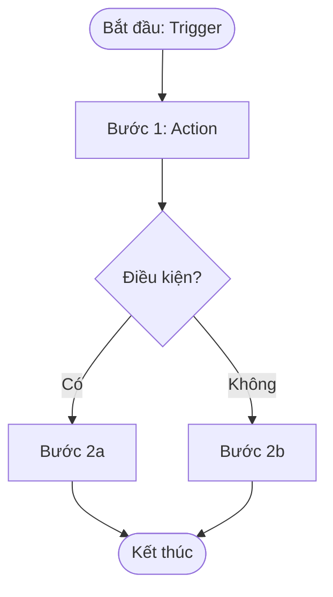
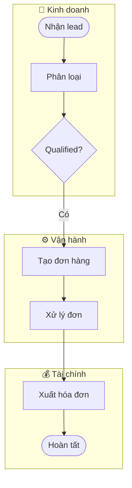
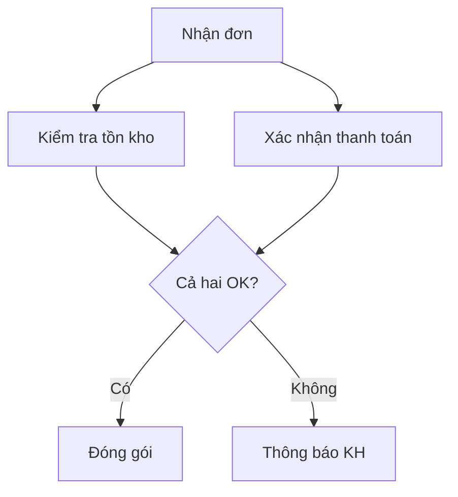
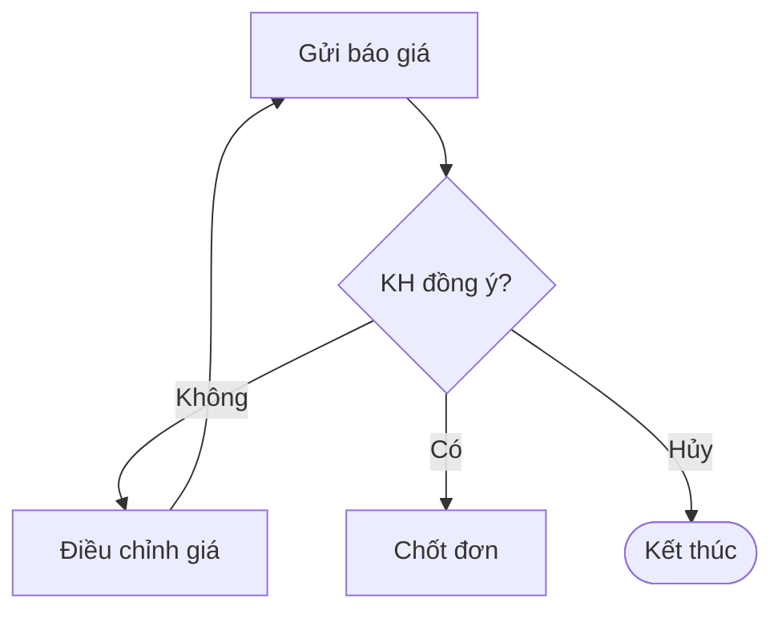
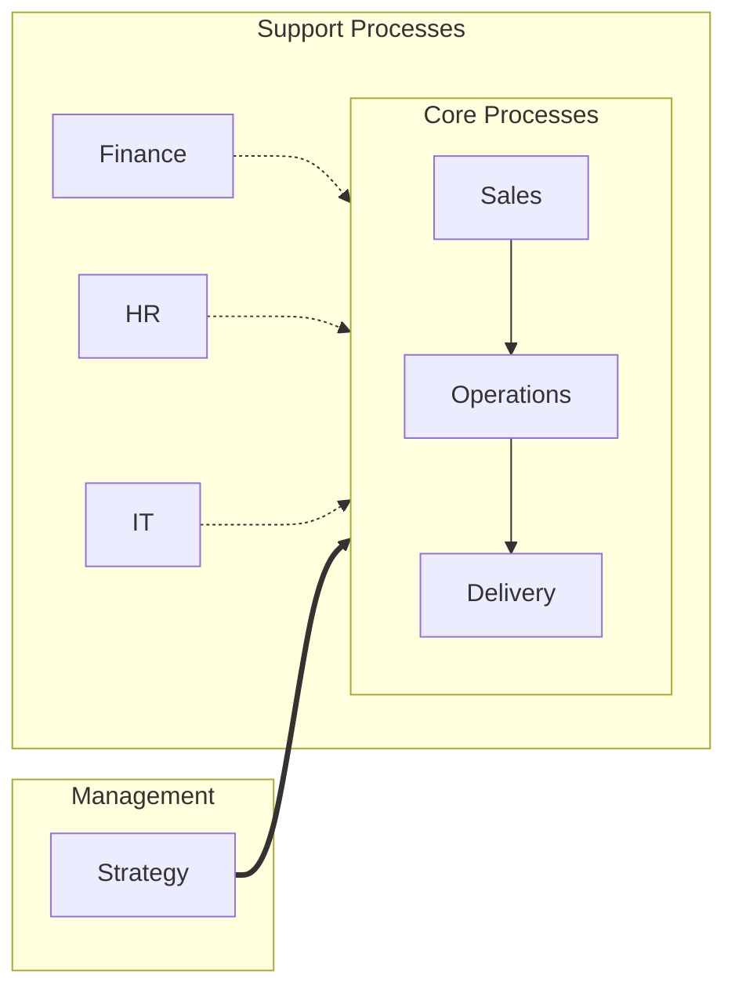

# Mermaid BPMN Patterns for Business Processes

## Basic Process Flow



## Multi-Department (Swimlanes)



## Color Coding Convention

```
style manual_step fill:#FF9800,stroke:#E65100,color:#000
style digital_step fill:#4CAF50,stroke:#1B5E20,color:#fff
style pain_point fill:#F44336,stroke:#B71C1C,color:#fff
style decision fill:#2196F3,stroke:#0D47A1,color:#fff
style start_end fill:#9E9E9E,stroke:#424242,color:#fff
```

| Color | Meaning | Hex |
|-------|---------|-----|
| Orange | Manual step | #FF9800 |
| Green | Digital/automated step | #4CAF50 |
| Red | Pain point / bottleneck | #F44336 |
| Blue | Decision point | #2196F3 |
| Grey | Start / End | #9E9E9E |

## Parallel Tasks



## Loop / Retry Pattern



## Process Landscape (High-Level)

For the overall company view, use a left-to-right flow:



Use:
- `-->` solid arrow: direct flow
- `-.->` dotted arrow: supporting relationship
- `==>` thick arrow: governance/oversight

## Tips

- Keep diagrams under 15 nodes for readability
- Split complex processes into sub-diagrams
- Use Vietnamese labels inside nodes
- Add emoji prefix in subgraph titles for visual clarity
- Always apply color coding to distinguish manual vs digital
