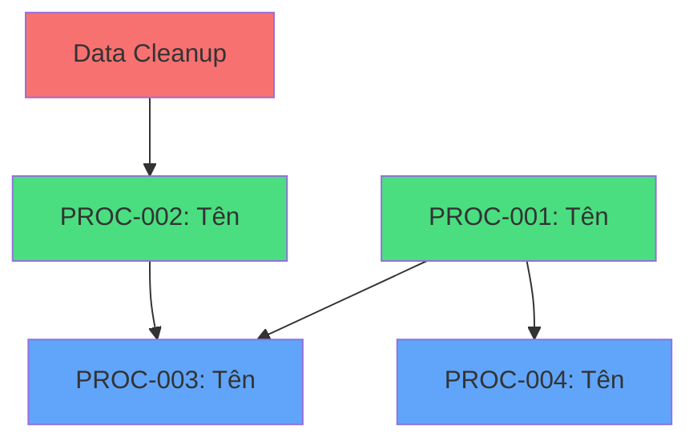
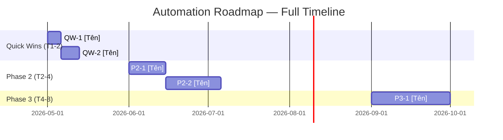

# Roadmap Output Format

Save to: `plans/reports/automation-roadmap-{company-slug}-YYMMDD-HHmm.md`

---

```markdown
# Automation Roadmap: [Company Name]

**Ngày:** YYYY-MM-DD | **Nguồn:** [assessment file path] | **Tổng processes:** N

## Executive Summary

- **Quick Wins:** N processes, ước tính tiết kiệm X giờ/tháng (~X VND)
- **Phase 2:** N processes, ước tính tiết kiệm X giờ/tháng (~X VND)
- **Phase 3:** N processes, ước tính tiết kiệm X giờ/tháng (~X VND)
- **Total ROI Year 1:** ~X VND tiết kiệm vs ~Y VND đầu tư (payback: Z tháng)
- **Khuyến nghị bắt đầu:** [Tên Quick Win đầu tiên — lý do ngắn gọn]

---

## Priority Matrix

| PROC-ID | Quy trình | Auto Score | ROI | Pain | Ease | Priority | Phase | Effort | Tiết kiệm/tháng |
|---------|-----------|-----------|-----|------|------|----------|-------|--------|----------------|
| PROC-001 | [Tên] | 8/10 | 8 | 7 | 9 | 8.0 | Quick Win | 3 ngày | 20 giờ |
| PROC-002 | [Tên] | 6/10 | 6 | 5 | 6 | 5.9 | Phase 2 | 2 tuần | 12 giờ |

---

## Process Entry Template

_Use this structure for each item under Phase 1 / Phase 2 / Phase 3:_

### [QW/P2/P3]-N: [Tên Quy Trình] (PROC-XXX)

- **Loại automation:** [n8n / Zapier / Script / AI API / AI Agent]
- **Mô tả:** [Cụ thể cần tự động hóa gì]
- **Effort:** [X person-days]
- **Chi phí setup:** [~X VND]
- **Chi phí hàng tháng:** [~X VND]
- **Tiết kiệm hàng tháng:** [X giờ = ~Y VND]
- **Phụ thuộc:** [Không / PROC-YYY phải xong trước]
- **Rủi ro:** Thấp / Trung bình / Cao
- **Metric đo lường:** [Cách xác nhận thành công]

---

## Phase 1: Quick Wins (Tháng 1-2)

[List entries using Process Entry Template above]

## Phase 2: Medium Impact (Tháng 2-4)

[List entries using Process Entry Template above]

## Phase 3: Strategic (Tháng 4-8)

[List entries using Process Entry Template above]

---

## Backlog

| PROC-ID | Quy trình | Lý do hoãn | Xem lại |
|---------|-----------|-----------|---------|
| PROC-XXX | [Tên] | [ROI thấp / quá phức tạp / chờ tool] | Q3/Q4 2026 |

---

## Dependency Map



Legend: xanh lá = Quick Win, xanh dương = Phase 2, đỏ = prerequisite

---

## Budget Summary

| Phase | Chi phí setup | Chi phí/tháng | Tiết kiệm/tháng | Payback |
|-------|--------------|--------------|-----------------|---------|
| Quick Wins | ~X VND | ~X VND | ~X VND | X tháng |
| Phase 2 | ~X VND | ~X VND | ~X VND | X tháng |
| Phase 3 | ~X VND | ~X VND | ~X VND | X tháng |
| **Tổng** | **~X VND** | **~X VND** | **~X VND** | **X tháng** |

---

## Full Gantt Timeline



---

## Next Steps

1. Phê duyệt roadmap này
2. Chọn Quick Win đầu tiên → `/ng:biz-deep-dive "[tên quy trình]"`
3. Xây SOP → `/ng:biz-sop @detailed-spec.md`
4. Triển khai và đo lường theo metric đã định
5. Review hàng tháng, điều chỉnh priority nếu cần
```
